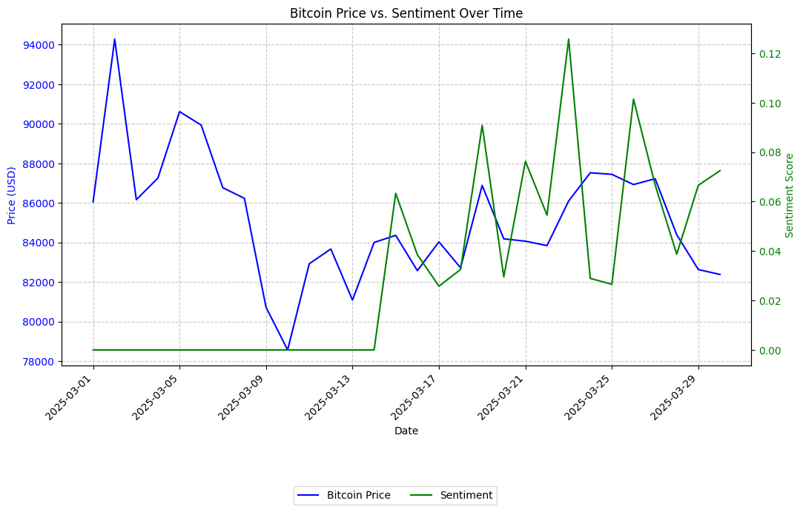
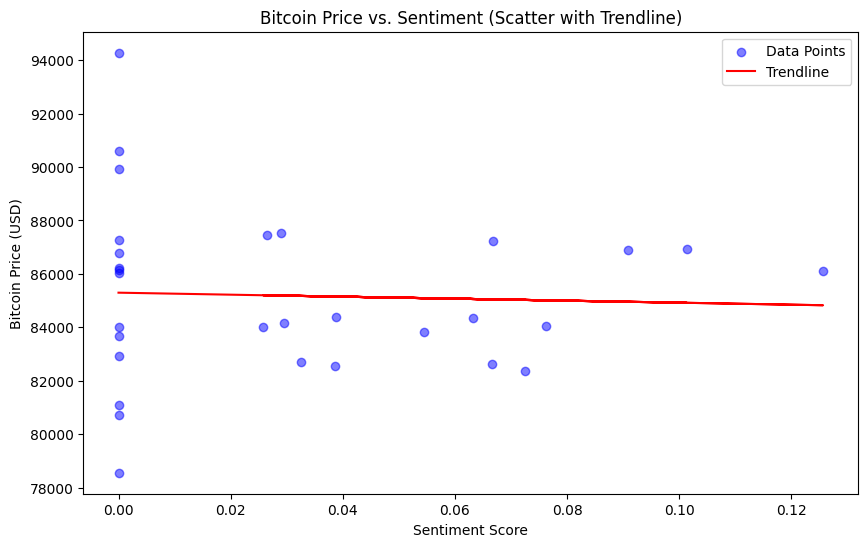
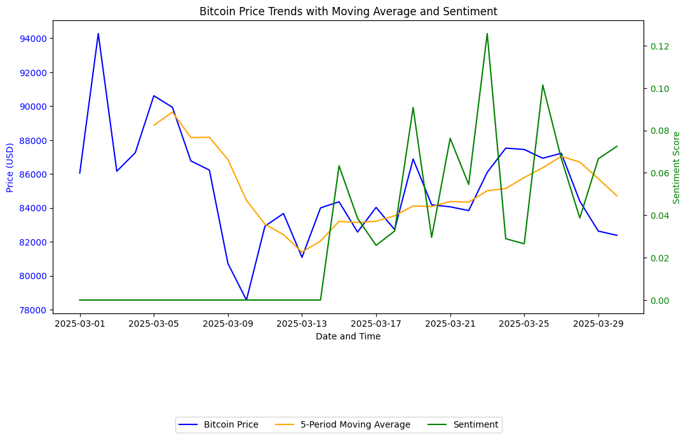
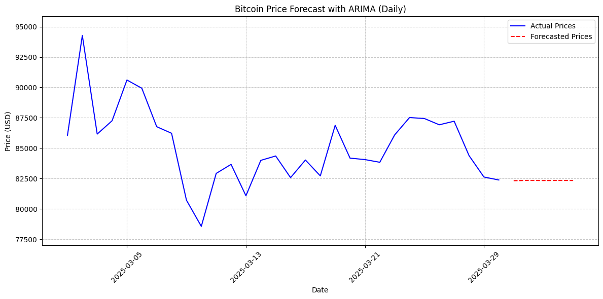

# Cryptocurrency Sentiment Dashboard
A project to explore Bitcoin price trends and sentiment analysis.

## Project Overview
This project is a comprehensive data pipeline and visualization tool that collects, processes, and analyzes Bitcoin price and Reddit sentiment data to uncover trends and update live bitcoin to the dashboard. Built from scratch, it demonstrates end-to-end skills in data collection, transformation, storage, analysis, and deployment, culminating in a live, interactive dashboard hosted on Heroku. It processes 30 days of historical data and extends insights with real-time updates, showcasing proficiency in handling financial and social media datasets.

- **Objective**: Explore the relationship between Bitcoin price fluctuations and social sentiment from `r/Bitcoin`, delivering insights through statistical models, visualizations, and a scalable web application.
- **Key Features**:
  - Historical and real-time data ingestion from APIs and Reddit.
  - Data merging and migration across SQLite and Heroku Postgres.
  - Time series analysis, predictive modeling, and interactive visualization.

## Technical Highlights
- **Data Collection**: Integrated CryptoCompare API for Bitcoin price/volume and PRAW for Reddit sentiment.
- **Data Processing**: Merged datasets, handled missing values, and migrated data to a cloud database.
- **Analysis**: Applied moving averages, ARIMA forecasting, and linear regression to derive insights.
- **Visualization**: Created static plots (Matplotlib) and a live Dash dashboard (Plotly).
- **Deployment**: Leveraged Heroku for real-time updates and web hosting.

#### `get_bitcoin_data.py`
This script fetches historical daily Bitcoin (BTC) price and volume data in USD from the CryptoCompare API, processes it, and saves it to both a CSV file and a SQLite database.

- **Functionality**:
  - Fetches data for the last 30 days from the current date (UTC).
  - Retrieves closing price and trading volume for each day.
  - Saves data to `bitcoin_prices.csv` (CSV format) and `crypto_data.db` (SQLite database, table `bitcoin_prices`).
  - Handles errors for API requests, file writing, and database operations.

- **Key Components**:
  - `fetch_bitcoin_data(start_date, end_date)`: Queries the CryptoCompare API and returns a list of daily BTC data.
  - `main()`: Manages the workflow, including date range setup, data fetching, and storage.

#### `scrape_reddit_sentiment.py`
This script fetches real-time sentiment data from the `r/Bitcoin` subreddit for the last 30 days, analyzes it using VADER sentiment analysis, and stores the results in both CSV and SQLite formats.

- **Functionality**:
  - Connects to Reddit’s API via PRAW to retrieve up to 1000 recent posts from `r/Bitcoin`.
  - Analyzes the sentiment of each post’s title using the VADER SentimentIntensityAnalyzer (compound score: -1 to 1).
  - Aggregates sentiment by day, averaging scores for posts within the specified 30-day range.
  - Assigns 0.0 sentiment to days with no posts in the range.
  - Saves the data to `reddit_sentiment.csv` and the `reddit_sentiment` table in `crypto_data.db`.

#### `merge_data.py`
Merges Bitcoin price data with real Reddit sentiment data into a single dataset.

- **Functionality**:
  - Loads `bitcoin_prices` (price, volume) and `reddit_sentiment` (sentiment) from `crypto_data.db`.
  - Merges on `timestamp` using a left join, keeping all price data.
  - Fills missing sentiment with 0.
  - Saves to `bitcoin_prices_with_sentiment` (SQLite and CSV).

#### `analyze_bitcoin_data.py`
This script performs a basic statistical analysis of Bitcoin price data stored in `bitcoin_prices_with_sentiment.csv`.

- **Functionality**:
  - Loads Bitcoin price data from `bitcoin_prices_with_sentiment.csv`.
  - Calculates and displays:
    - Average price over the dataset.
    - Minimum price in the dataset.
    - Maximum price in the dataset.
  - Prints the full dataset for review.

#### `plot_price_sentiment.py`
This script generates a dual-axis line plot comparing Bitcoin price and sentiment scores over time, using data from `crypto_data.db`, with enhanced readability and error handling.

- **Functionality**:
  - Loads data from the `bitcoin_prices_with_sentiment` table in `crypto_data.db`.
  - Plots:
    - Bitcoin price (USD) on the left y-axis (blue line).
    - Sentiment scores (-1 to 1) on the right y-axis (green line).
    - X-axis shows dates in `YYYY-MM-DD` format.
  - Includes gridlines for easier value tracking.
  - Saves the plot as `price_vs_sentiment.png`.

#### `calculate_correlation.py`
This script calculates and interprets the Pearson correlation coefficient between Bitcoin price and sentiment scores using data from `crypto_data.db`.

- **Functionality**:
  - Loads data from the `bitcoin_prices_with_sentiment` table in `crypto_data.db`.
  - Computes the Pearson correlation between `price` and `sentiment`.
  - Displays the correlation value and a simple interpretation (positive, negative, or no correlation).

#### `scatter_price_sentiment.py`
This script generates a scatter plot with a trendline to explore the relationship between Bitcoin price and sentiment scores, using data from `crypto_data.db`.

- **Functionality**:
  - Loads data from the `bitcoin_prices_with_sentiment` table in `crypto_data.db`.
  - Creates a scatter plot:
    - X-axis: Sentiment scores (-1 to 1).
    - Y-axis: Bitcoin price (USD).
    - Blue dots represent individual data points.
  - Adds a red linear trendline to show the general relationship.
  - Saves the plot as `scatter_price_sentiment.png`.
  

#### `predict_price.py`
This script trains a linear regression model to predict Bitcoin price based on sentiment scores, using data from `crypto_data.db`, and evaluates its performance.

- **Functionality**:
  - Loads data from the `bitcoin_prices_with_sentiment` table in `crypto_data.db`.
  - Uses sentiment as the feature to predict Bitcoin price.
  - Splits data into 80% training and 20% testing sets.
  - Trains a linear regression model and makes predictions on the test set.
  - Evaluates the model with Mean Squared Error (MSE) and R-squared (R²) metrics.
  - Prints model coefficients and an interpretation of fit quality.

#### `time_series_analysis.py`
This script performs a time series analysis on Bitcoin price data, plotting price trends with a 5-day moving average and sentiment, and calculating daily price changes.

- **Functionality**:
  - Loads data from the `bitcoin_prices_with_sentiment` table in `crypto_data.db`.
  - Plots:
    - Bitcoin price (blue) and 5-day moving average (orange) on the left y-axis.
    - Sentiment score (green) on the right y-axis.
  - Calculates and displays daily price change statistics.
  - Saves the plot as `price_trends_with_sentiment.png`.

#### `arima_forecast.py`
This script uses an ARIMA model to forecast Bitcoin prices for the next 5 days based on historical daily data from `crypto_data.db`.

- **Functionality**:
  - Loads daily price data from the `bitcoin_prices` table in `crypto_data.db`.
  - Fits an ARIMA(1,1,1) model to the price series.
  - Forecasts prices for the next 5 days.
  - Plots historical prices (blue) and forecasted prices (red dashed line).
  - Saves the plot as `arima_forecast.png` and prints the forecast values.

#### `migrate_to_postgres.py`
This script migrates Bitcoin price and sentiment data from a local SQLite database (`crypto_data.db`) to a Heroku Postgres database for use with web applications like `app.py`.

- **Functionality**:
  - Reads the `bitcoin_prices_with_sentiment` table from `crypto_data.db` (SQLite).
  - Validates that data is present and readable.
  - Connects to a Heroku Postgres database using the `DATABASE_URL` environment variable.
  - Verifies the target is a Postgres database.
  - Writes the data to a `bitcoin_prices_with_sentiment` table in Postgres, replacing any existing table.

#### `app.py`
This script creates an interactive Dash web dashboard to visualize Bitcoin price and Reddit sentiment trends over time, fetching data from a Heroku Postgres database.

- **Functionality**:
  - Initializes a Dash application with two line graphs:
    - Bitcoin price over time.
    - Reddit sentiment over time (ranging from -1 to 1).
  - Fetches data from the `bitcoin_prices_with_sentiment` table in a Heroku Postgres database using SQLAlchemy.
  - Updates the graphs every 60 seconds via a `dcc.Interval` component.
  - Displays the last updated timestamp in UTC.
  - Handles empty data gracefully with placeholder "No Data Available" graphs.

#### `live_updates.py`
This script runs a continuous worker process to fetch live Bitcoin price, volume, and Reddit sentiment data, updating a Heroku Postgres database every minute.

- **Functionality**:
  - **Bitcoin Data**: Fetches current Bitcoin price (USD) and approximate volume from CryptoCompare API.
  - **Reddit Sentiment**: Streams new posts from `r/Bitcoin` for 60 seconds, calculates average sentiment using VADER, and assigns it to the current minute.
  - **Database Updates**: Inserts or updates the `bitcoin_prices_with_sentiment` table in Heroku Postgres with timestamp, price, volume, and sentiment.
  - Runs in an infinite loop, syncing updates to the start of each minute.

#### 'How to try this project'
git clone <https://github.com/Sairam0503/crypto-sentiment-dashboard>
cd crypto-sentiment-dashboard
pip install -r requirements.txt

Run 
1. get_bitcoin_data.py
2. scrape_reddit_sentiment.py
3. merge_data.py

4. set DATABASE_URL=postgres://.........../db6st1ghre0bl6
    To get DATABASE_URL
    - create heroku account
    - login to heroku (heroku login)
    - heroku create <dashboard_name>
    - set dynos (heroku ps:scale web=1 worker=1 -a <dashboard_name>)
    - add add-on plan (heroku-postgresql)
    - get DATABASE URL (heroku config -a <dashboard_name>)
    - set set DATABASE_URL= (postgres://......./db6st1ghre0bl6)
5. migrate_to_postgres.py
6. app.py
7. live_updates.py
8. Heruko open

